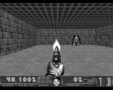
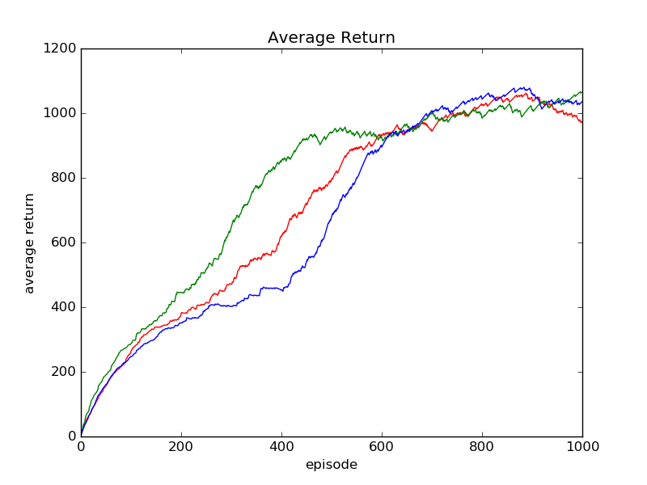

# Deep Reinforcement Learning in Keras and ViZDoom

Implementation of deep reinforcement learning algorithm on the Doom environment

The features that were implemented are:
- DQN
- Double DQN
- Prioritized Experience Replay
- Next state prediction (WIP)
- Exploration policies: e-greedy, softmax or shifted multinomial
- Architectures: Sequential Q estimation, Inception Q estimation, Dueling Q estimation  

trained models are also supplied

## Results

DDQN runs:

State prediction:

actual:

predicted:

actual:

predicted:

Exploration policies:

Tested on health gathering level for 1000 episodes

red - softmax, green - shifted multinomial, blue - e-greedy

## Details

### DQN

Deep Q-Network implementation

Reference: https://www.cs.toronto.edu/~vmnih/docs/dqn.pdf

### DDQN

Double Deep Q-Network implementation

Details: Reduces value overestimation in DQN

Reference: https://arxiv.org/pdf/1509.06461.pdf

### Prioritized Experience Replay

Chooses the most influencing states from the experience replay by using the TD-error as the priority

Reference: http://www0.cs.ucl.ac.uk/staff/d.silver/web/Publications_files/prioritized-replay.pdf

### Next state prediction

Action-conditional video prediction implementation

Details: Predicts the next state given the current state and an action to simulate the value function of actions not actually taken
uses an Autoencoder integrated into a Generative Adverserial Network

Partial reference: https://sites.google.com/a/umich.edu/junhyuk-oh/action-conditional-video-prediction

### Exploration policies

**e-Greedy** - Choose an epsilon and choose a random number. If the number is greater than epsilon, choose the max value action. Otherwise, choose a random action.

**Softmax** - Choose a random number and select the action by a multinomial probability ordered by prob(a) = e^(Q(a)/temp)/sum(e^(Q(a)/temp)).

**Shifted Multinomial** - Similiar to softmax but chooses the action by the order shifted_Q(a) = Q(a)-min(avg(min(Q(a)), min(Q(a))). prob(a) = shifted_Q(a)/sum(shifted_Q(a)). 

### Dueling Network Architecture

Estimates the state-value function V and the action advantage function A and combines them to produce the state-action value Q as part of the deep network.

Reference: https://arxiv.org/pdf/1511.06581.pdf

## More Results

### Basic Level DQN training process

Average return over 10000 episodes

### Basic Level DDQN training process

Average return over 10000 episodes

### Health Gathering Level DDQN training process

Average return over 500 episodes

## Author

Itai Caspi
