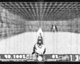
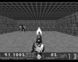
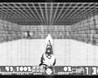
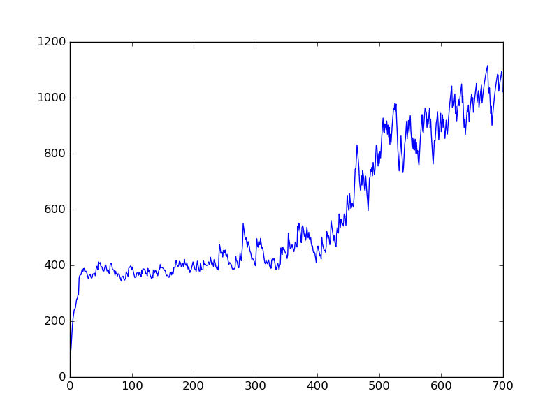

# Deep Reinforcement Learning in Keras and ViZDoom

Implementation of deep reinforcement learning algorithm on the Doom environment

The features that were implemented are:
- DQN
- Double DQN
- Prioritized Experience Replay
- Next state prediction (WIP)
- e-greedy, softmax or shifted multinomial exploration policies

trained models are also supplied

## Results

DDQN runs:

State prediction:

actual:

predicted:

actual:

predicted:

## DQN

Deep Q-Network implementation

Reference: https://www.cs.toronto.edu/~vmnih/docs/dqn.pdf

## DDQN

Double Deep Q-Network implementation

Details: Reduces value overestimation in DQN

Reference: https://arxiv.org/pdf/1509.06461.pdf

## Prioritized Experience Replay

Chooses the most influencing states from the experience replay by using the TD-error as the priority

Reference: http://www0.cs.ucl.ac.uk/staff/d.silver/web/Publications_files/prioritized-replay.pdf

## Next state prediction

Action-conditional video prediction implementation

Details: Predicts the next state given the current state and an action to simulate the value function of actions not actually taken
uses an Autoencoder integrated into a Generative Adverserial Network

Reference: https://sites.google.com/a/umich.edu/junhyuk-oh/action-conditional-video-prediction

## Basic Level DQN training process

Average return over 10000 episodes

## Basic Level DDQN training process

Average return over 10000 episodes

## Health Gathering Level DDQN training process

Average return over 500 episodes

## Author

Itai Caspi
